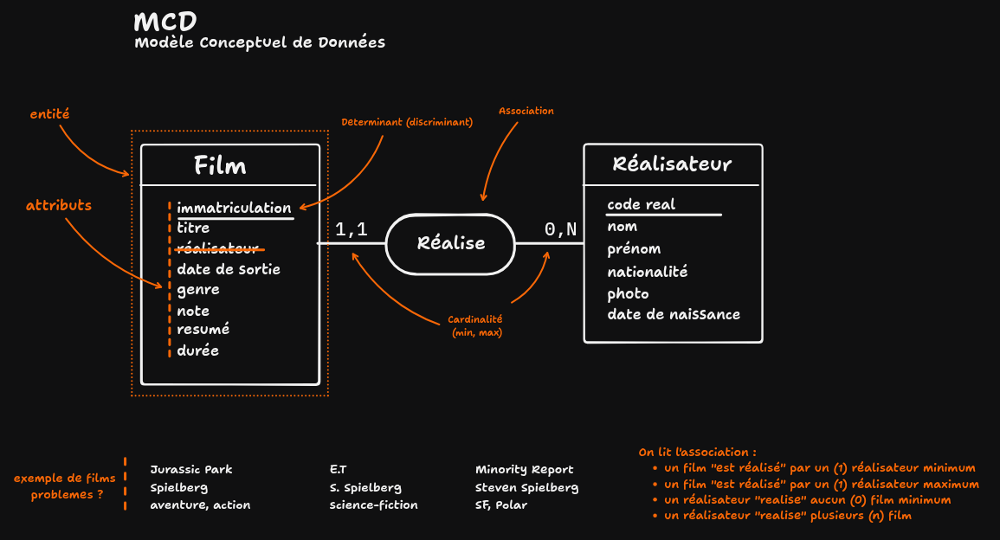

# LES BASES DE DONNEES

## Conception 
Le MCD (Modèle Conceptuel de Données) est un schéma qui permet de *représenter* les données d'une application. Il est composé d'entités, d'attributs et d'associations.

Premier essai avec Film et Réalisateur.


Premier essai [MOCODO](https://mocodo.net/) :
```
Film: Immatriculation, Titre, Année, Genre, Durée
REALISE, 11 Film, 0N Réalisateur
Réalisateur: codeReal, nom, prénom, date de naissance, photo
```

> On essaie avec notre application TrombinOclock

```
Promotion: code promo, Nom, Orga Github
COMPOSE, 11 Etudiant, 0N Promotion
Etudiant: code etudiant, Prénom, Nom, Pseudo Github, Photo
```

Pour simplifier les associations on regarde la valeur maximale de chaque côté de l'association et on parle de one-to-many et many-to-many.

> Un à plusieurs (1N) : ex. une promotion possède plusieurs étudiants

> Plusieurs à plusieurs (NN) : ex. un professeur enseigne à plusieurs promos, une promo a plusieurs professeurs

Mais on reparlera de ça en saison 4 😊

⚠️ Attention au vocabulaire

Le MLD (Modèle Logique de Données) est une représentation *plus proche de la réalité technique*. Il est composé de tables, de colonnes et de clés.

On passe du MCD au MLD en identifiant les clés primaires et étrangères.

Si une cardinalité est *one-to-many*, on ajoute la clé étrangère dans la table côté 1.

```
- PROMO (id, github_organization, name)
- STUDENT (id, first_name, last_name, github_username, profile_picture_url, #PROMO(id))
```

Cela se vérifie dans le students.json 😊

SCHEMA DES SERVICES/ACTEURS dans l'application
- client web (navigateur)
- serveur web (express sous node.js)
- serveur de base de données (postgresql)
- client en ligne de commande (psql)