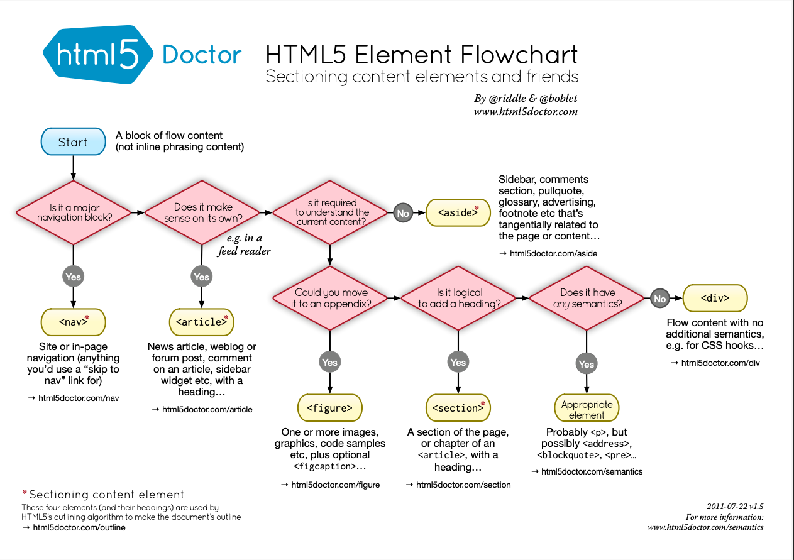

# 🧩 Choisir les bonnes balises HTML selon le contexte



## 🎯 Pourquoi cette fiche ?

HTML5 met à disposition des balises **sémantiques** permettant de structurer le contenu intelligemment.  
Bien choisir sa balise améliore :

- l’**accessibilité** (lecteurs d’écran, navigation),
- le **SEO**,
- la **clarté** et la **maintenance** du code.

Cette fiche t’aide à choisir la **bonne balise** selon le _type de contenu_.

---

## 🧮 Règles essentielles

1. **Une seule balise `<main>` par page.**
2. `<header>` et `<footer>` peuvent exister globalement _et_ dans des `<section>` / `<article>`.
3. `<nav>` = navigation principale.
4. `<section>` = regroupe du contenu **lié thématiquement**.
5. `<article>` = contenu **autonome**, pouvant exister seul (post, fiche produit, commentaire…).
6. `<aside>` = contenu **secondaire** ou contextuel.
7. Une `<section>` ou un `<article>` **devrait contenir un titre**.

---

## 📋 Tableau rapide

| Contexte            | Balise      | Pourquoi                         |
| ------------------- | ----------- | -------------------------------- |
| En-tête global      | `<header>`  | Présente le site                 |
| Liens de navigation | `<nav>`     | Menu principal ou secondaire     |
| Contenu principal   | `<main>`    | Le cœur de la page               |
| Groupe thématique   | `<section>` | Organise le contenu en parties   |
| Contenu autonome    | `<article>` | Peut être partagé indépendamment |
| Contenu secondaire  | `<aside>`   | Informations connexes            |
| Pied de page        | `<footer>`  | Infos légales, navigation finale |

---

## 🧠 Exemples

### Exemple 1 : page de blog

```html
<body>
  <header>
    <nav><!-- Menu --></nav>
  </header>

  <main>
    <article>
      <h1>Titre</h1>
      <p>Contenu…</p>
    </article>

    <aside>
      <h2>À propos</h2>
      <p>Infos...</p>
    </aside>
  </main>

  <footer>© 2025</footer>
</body>
```

---

### Exemple 2 : documentation technique

```html
<body>
  <header>
    <nav><!-- Navigation de la doc --></nav>
  </header>

  <main>
    <section>
      <h1>Introduction</h1>
      <p>…</p>
    </section>

    <section>
      <h1>Fonctionnalités</h1>

      <article>
        <h2>Option A</h2>
        <p>…</p>
      </article>

      <article>
        <h2>Option B</h2>
        <p>…</p>
      </article>
    </section>
  </main>

  <footer>Dernière mise à jour : 2025</footer>
</body>
```

---

## 💡 Bonnes pratiques

- Utilise des balises sémantiques **dès que possible**.
- Un `<section>` sans titre n’est généralement **pas correct**.
- `<article>` doit pouvoir être extrait du contexte (post, news, fiche…).
- `<aside>` sert aux éléments **non essentiels**, mais liés.
- Utilise `<div>` uniquement pour la mise en page ou lorsque rien d’autre ne convient.

---

## 📎 Ressource

Schéma décisionnel officiel (PDF) :  
👉 https://html5doctor.com/downloads/h5d-sectioning-flowchart.pdf

Utilise-le lorsque tu hésites entre `<section>`, `<article>` et `<aside>`.

---

## 🔔 À retenir

> **Autonome → `<article>`**  
> **Thématique → `<section>`**  
> **Secondaire → `<aside>`**  
> **Structure globale → `<header>`, `<nav>`, `<main>`, `<footer>`**
