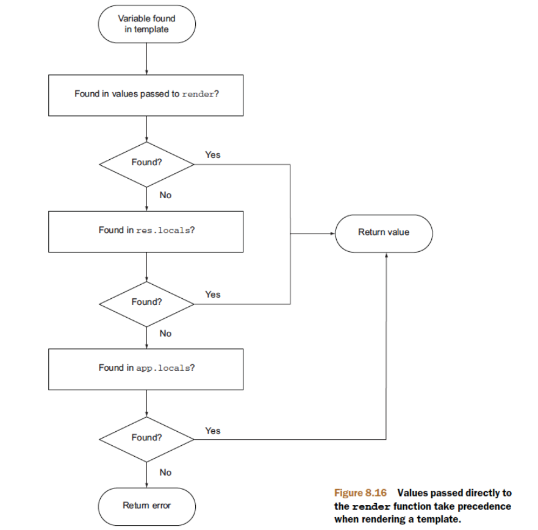

# 🧩 Fiche Récap – Comment Express cherche les données dans les **locals**



Ccomment Express retrouve la valeur d’une **variable utilisée dans un template** (EJS dans notre cas), en suivant l’ordre du diagramme :

1. Les données passées directement à `res.render()`
2. Puis `res.locals`
3. Puis `app.locals`
4. Sinon : erreur (variable introuvable)

---

## Le chemin de recherche d’une variable dans un template

Quand le moteur de template rencontre une variable (par ex. `user` dans ton EJS) :

1. **Est-ce que la variable est fournie à `res.render()` ?**

   - ✅ Oui → on utilise cette valeur
   - ❌ Non → on passe à l’étape suivante

2. **Est-ce que la variable est présente dans `res.locals` ?**

   - ✅ Oui → on utilise cette valeur
   - ❌ Non → on passe à l’étape suivante

3. **Est-ce que la variable est présente dans `app.locals` ?**
   - ✅ Oui → on utilise cette valeur
   - ❌ Non → **erreur** (variable introuvable dans le template)

👉 **Priorité (du plus fort au moins fort)** :  
`res.render()` **>** `res.locals` **>** `app.locals`

---

## À quoi servent `app.locals` et `res.locals` ?

### `app.locals` – Valeurs globales à toute l’application

- Défini au niveau de l’**application** Express.
- Accessible dans **toutes les vues**, pour **toutes les requêtes**.
- Idéal pour :
  - le nom du site,
  - un logo,
  - une version,
  - des constantes globales.

```js
// Dans ton fichier principal (app.js par ex.)
app.locals.siteName = "My Super App";
app.locals.year = 2025;
```

Dans ton template (ex : EJS) :

```ejs
<title><%= siteName %></title>
<footer>© <%= year %></footer>
```

---

### `res.locals` – Valeurs spécifiques à UNE requête

- Défini au niveau de la **réponse** (objet `res`).
- Lié à **une seule requête**.
- Idéal pour :
  - l’utilisateur connecté,
  - les messages flash,
  - les données calculées par un middleware pour cette requête.

```js
app.use((req, res, next) => {
  res.locals.currentUser = req.user || null;
  res.locals.isAdmin = req.user?.role === "admin";
  next();
});
```

Dans le template :

```ejs
<% if (isAdmin) { %>
  <a href="/admin">Admin</a>
<% } %>
```

## Le lien vers l’admin n’apparaîtra que si l’utilisateur connecté est un admin.

### `res.render()` – Valeurs spécifiques à UNE vue

- Tu peux passer un objet directement à `res.render()`.
- Ces valeurs ont **la priorité la plus haute**.
- Elles ne concernent que **ce rendu de vue précis**.

```js
app.get("/profile", (req, res) => {
  res.render("profile", {
    pageTitle: "Mon profil",
    showSidebar: true,
  });
});
```

Dans le template :

```ejs
<h1><%= pageTitle %></h1>
<% if (showSidebar) { %>
  <aside>…</aside>
<% } %>
```

## Le titre de la page et la sidebar sont spécifiques à cette vue. La sidebar n’apparaîtra que si `showSidebar` est vrai.

## Exemple complet avec priorité

```js
app.locals.title = "Titre global";

app.use((req, res, next) => {
  res.locals.title = "Titre middleware";
  next();
});

app.get("/", (req, res) => {
  res.render("home", { title: "Titre rendu" });
});
```

Dans la vue `home.ejs` :

```ejs
<h1><%= title %></h1>
```

👉 Résultat affiché : **"Titre rendu"**

Car :

1. `res.render("home", { title: "Titre rendu" })` → **prioritaire**
2. `res.locals.title = "Titre middleware"` → utilisé seulement si rien n’est passé dans `render`
3. `app.locals.title = "Titre global"` → utilisé uniquement si ni `render` ni `res.locals` ne définissent `title`

---

## En Résumé

- **`app.locals`**

  - Global à TOUTE l’appli
  - Même valeur pour toutes les requêtes
  - Parfait pour : nom du site, année, config globale

- **`res.locals`**

  - Spécifique à UNE requête
  - Souvent rempli par des middlewares
  - Parfait pour : utilisateur connecté, messages, données calculées

- **Objet passé à `res.render()`**
  - Spécifique à UN rendu de vue
  - **Toujours prioritaire** sur `res.locals` et `app.locals`

> 🧡 À retenir :  
> Quand une variable est utilisée dans un template, Express la cherche dans cet ordre :  
> **`res.render()` → `res.locals` → `app.locals` → sinon : erreur**.
